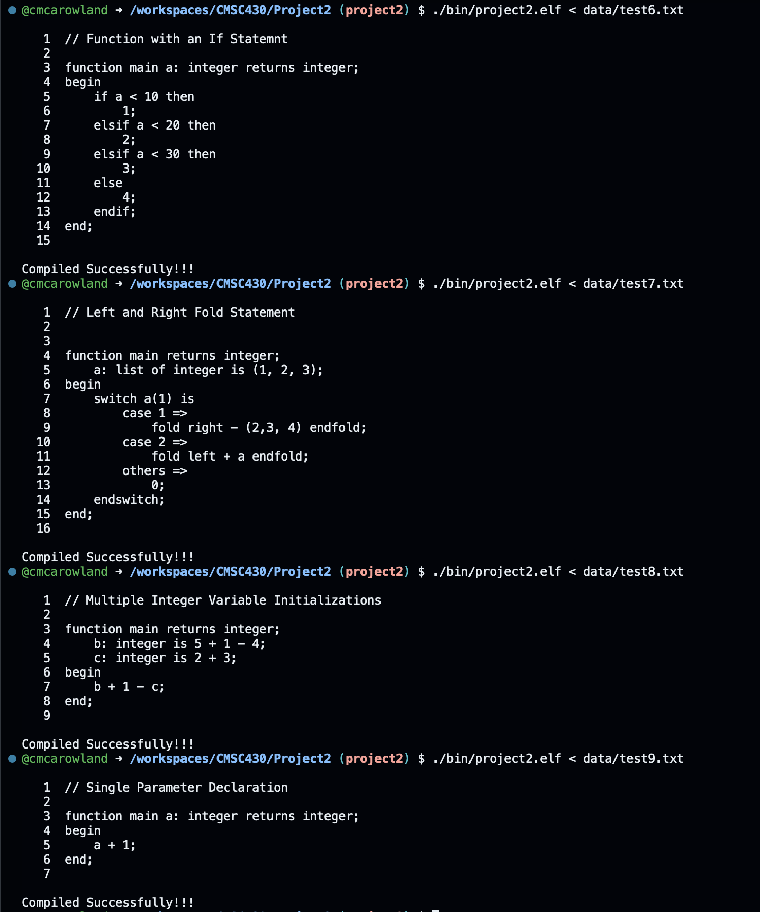

# PROJECT 2

## Functionality
1. Parses all syntactically correct programs
   - [x] Include literals for real data type
   - [x] Add if/else/elif statements
   - [x] Create Fold statment
      - [x] Implement direction and operator
   - [x] Implement variable declaration for 0...N variables
   - [x] Implement parameter declarations for function header
      - [x] Allow for comma separated multiple parameters for functions
2. Productions correctly implement precedence and associativity
   - [x] Add binary arithmetic operators for:
      - [x] Mod
      - [x] Exponent
      - [x] unary minus
   - [x] Ensure precedence
3. Grammar contains no shift/reduce or reduce/reduce errors
   - [x] Ensure build completes without shift/reduce
4. Detects and recovers from all programs with single syntax errors
   - [x] Run syntax tests to ensure proper error recovery
5. Detects and recovers from a program with multiple syntax errors
   - [x] Run syntax tests to ensure proper error recovery

---

## Test Cases

1. [x] Includes test cases that test all grammar productions
2. [x] Includes test cases that test errors in all productions
3. [x] Includes test case with multiple errors

Test cases Images

Test cases 1-5

Test cases 6-9

Test cases 10-13

Test cases 14 and Syntax cases 1 and 2

Syntax cases 3 and 4

Syntax case 5

Google Test Output

---

### Documentation

1. Discussion of approach included
2. Lessons learned included
3. Comment blocks with student name, project, date and code description included in each file
