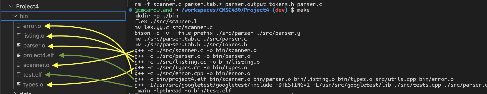

# Project 4

## Test Results
[View](https://html-preview.github.io/?url=https://github.com/cmcarowland/CMSC430/blob/main/Project4/testOutput.html)

## Steps 

- [x] Add Real data type
    - [x] Pass valid1.txt
- [x] Add hexidecimal integer literals
    - [x] Pass valid2.txt
- [x] Implement Int to real coercion works
    - [x] Pass valid3.txt
    - [x] Pass semantic(1-7).txt
- [x] Lists contain elements of only one type
    - [x] Pass semantic8.txt 1 semantic error should result
    - [x] Add action to expression, maybe create function in types
- [x] Ensure the type of the list varable matches its elements

## Scope Rules

- [x] Both expressions in the when statement must be the same type.
- [x] The type of the switch expression must be Integer.
- [x] All the case statements in a switch statement must match in type. No coercion is performed.
- [x] Arithmetic operators can only be used with numeric types.
- [x] All list elements must be of the same type.
- [x] In a list variable declaration, the type of the list must match the type of the elements.
- [x] List subscripts must be integer expressions.
- [x] Character literals can be compared to one another but they cannot be compared to numeric expressions.
- [x] Only integer operands can be used with the remainder operator.
- [x] All the statements in an if statement must match in type. No coercion is performed.
- [x] In a fold statement, the list must be a numeric type.
- [x] A narrowing variable initialization or function return error occurs when a real value is being forced into integer. Widening is permitted. In all other cases, the type must match.

## Type Coercion

- [x] Int To Real data type conversions

## Semantic Checks

- [x] Type Mismatch on Variable Initialization
- [x] When Types Mismatch
- [x] Switch Expression Not Integer
- [x] Case Types Mismatch
- [x] Arithmetic Operator Requires Numeric Types
- [x] Undeclared Scalar
- [x] Undeclared List
- [x] List Element Types Do Not Match
- [x] List Type Does Not Match Element Types
- [x] List Subscript Must Be Integer
- [x] Character Literals Cannot be Compared to Numeric Expressions
- [x] Remainder Operator Requires Integer Operands
- [x] If-Elsif-Else Type Mismatch
- [x] Fold Requires A Numeric List
- [x] Illegal Narrowing Variable Initialization
- [x] Illegal Narrowing Function Return
- [x] Type Mismatch on Function Return
- [x] Duplicate Scalar
- [x] Duplicate List

## Check for symbols 

- [x] Verify checks for undefined symbols
- [x] Add checks for duplicate identifiers

## Test Images

### Image showing compilation

### Image valid tests and semantic test 1 

### Image semantic tests 2-4 

### Image semantic tests 5-7

### Image semantic tests 8-10

### Image semantic tests 11-13

### Image semantic tests 14-14B

### Image semantic tests 14C - 15B

### Image semantic tests 15C - 15E

### Image semantic tests all 16 tests

### Image semantic tests 17 and 18 tests

### Image semantic 19 test

